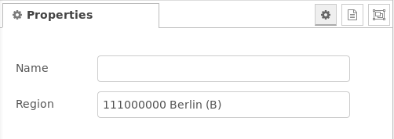
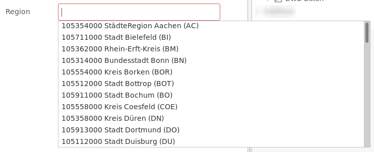
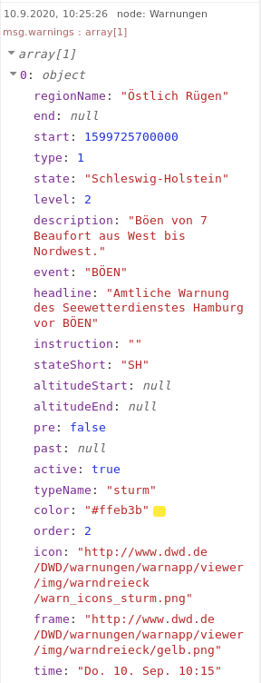
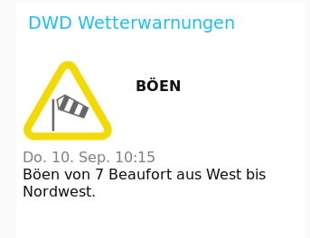
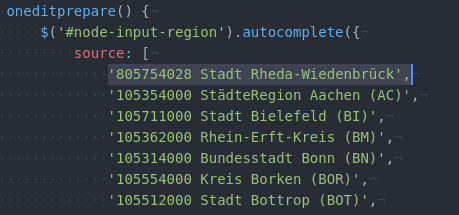

# node-red-contrib-dwd

[](http://badge.fury.io/js/node-red-contrib-dwd)
[](https://david-dm.org/hobbyquaker/node-red-contrib-dwd)
[](https://travis-ci.org/hobbyquaker/node-red-contrib-dwd)
[](https://github.com/sindresorhus/xo)
[![License][mit-badge]][mit-url]


Node-RED Node zum Abfragen von Wetterwarnungen des Deutschen Wetterdienstes (DWD).


  
**Fig. 1:** Darstellung des Nodes

---

__Remark:__ This Node is only useful if you're interested in weather warnings for **Germany**, it can't be used for other countries.

---


Die Wetterdaten werden vom DWD (Deutscher Wetterdienst, Frankfurter Straße 135, 63067 Offenbach) bereitgestellt.  
Sie können folgende Wetterwarnungen beinhalten:
- Wind (Böen, Sturm, Orkan)
- Gewitter
- Starkregen, Dauerregen
- Schneefall, Schneeverwehungen
- Glatteis, Glätte, Frost
- Nebel
- Tauwetter
- Hitze
- UV-Strahlung


<a name="installation"></a>
## Installation

<a name="installation_in_node-red"></a>
### In Node-RED (bevorzugt)
* Über *Manage palette* -> Nach "node-red-chttps://www.dwd.de/DWD/warnungen/warnapp_gemeinden/json/warnungen_gemeinde_map_de_gewitter.pngontrib-dwd" suchen und installieren

<a name="installation_in_a_shell"></a>
### Über eine Shell
* Ins Node-RED Installationsverzeichnis gehen, z.B.: `~/.node-red`
* Ausführen von `npm install node-red-contrib-dwd`

<a name="usage"></a>
## Verwendung
Die Verwendung des Nodes ist wie folgt:

  

**Fig. 2:** Grundsätzliche Verwendung des Nodes

Der Node wird über eine Eingangs-Message getriggert und gibt an seinem Ausgang die Wetterdaten aus.


<a name="node_configuration"></a>
### Node Configuration
In den Eigenschaften des Nodes ist lediglich die Einstellung der *Region* notwendig.  

  

**Fig. 3:** Node Eigenschaftendialog

Die auswählbaren Regionen bzw. Städte können durch Klicken in das Feld und Drücken z.B. der Leertaste dargestellt werden. Es öffnet sich dann ein Pulldown-Menü mit einer Auflistung:

  

**Fig. 4:** Pulldown-Menü mit einstellbaren Regionen/Städte


### Node-Eingang
Der Node wird über jede Eingangs-Message `msg` mit beliebigem Inhalt getriggert.


### Node-Ausgang
Der Node gibt eine `msg` an seinem Ausgang aus, sobald er über den Eingang getriggert wird.

#### Ausgangselemente
Die Elemente der `msg` sind:
* `payload` - Maximale Warnstufe aktueller Warnungen (*level* im Array *warnings*)
* `count` -  Anzahl der Warnungen (im Array *warnings*)
* `events` - Kommagetrennte Aufzählungen der Warnungskategorien (z.B. "BÖEN","STARKWIND","NEBEL")
* `warnings` - Array mit den detaillierten Daten der Warnungen
* `html` - HTML-Output zur Anzeige im Dashboard


#### Ausgangsarray *warnings*
Das Array beinhaltet alle Warnungen, die für die selektierte Region/Stadt aktiv sind. Oftmals ist dies maximal eine einzige Warnung, in diesem Falle enthält das Array nur ein Element (array[1] wie i Fig. 5 dargestellt).
Das Array besitzt die folgende Elementstruktur:

  

**Fig. 5:** Beispielinhalt des Ausgangsarray *warnings*

Zu den Details der Strukturelemente siehe auch unten die ***Informationen zu den DWD-Wetterdaten***.

Hervorzuheben sind folgende Strukturelemente:
- ***type***: Dies beinhaltet die Warnungskategorie (siehe auch Element *typeName* und *event*). Inhalte sind:
  - 0: Gewitter
  - 1: Sturm
  - 2: Regen
  - 3: Schnee
  - 4: Nebel
  - 5: Frost
  - 6: Glatteis
  - 7: Tauwetter
  - 8: Hitze
  - 9: UV-Strahlung
  - 10: Warnungen der Küstenbereiche
  - 11: Warnungen der Binnenseen
- ***start*** bzw. ***end***: Start- und Endezeit der Wetterwarnung
- ***level***: Dies ist die Warnstufe der Warnung
- ***instructions***: Hinweise zum eigenen Verhalten gegenüber der Wetterwarnung
- ***description***: Dies ist die textuelle Darstellung der Inhalte von *type* bzw. *typeName* bzw. *event* in Kombination mit *level*
- ***icon*** und ***frame***: Verlinkung auf Images, die kombiniert ein Warnungssymbol ergeben


Ein Beispiel für die Kombination aus Icon (Wind) und Warnstufe (Warnstufe 1, gelber Rand) sieht wie folgt aus:  
  

**Fig. 6:** Beispiel eines Warnungs-Icons (Quelle: Deutscher Wetterdienst DWD)


#### Ausgangsdatenelement *html*
Dieses Element gibt einen HTML-String mit einigen Warnungsdaten aus. Dieser String wird u.a. vom Wetterwarnungs-Dashboard-Template verwendet.

Das Ausgabeformat von *html* sieht wie folgt aus:

```html
<div class="dwd-warning-container">
    <div class="dwd-icon-container">
           
        
    </div>
    <div class="dwd-event">${warning.event}</div>
    <div class="dwd-time">${warning.time}</div>
    <div class="dwd-description">${warning.description}</div>
    <div class="dwd-instruction">${warning.instruction}</div>
</div>                             
```

Diese HTML-Code-Generierung befindet sich in *dwd.js* und kann ggfs. persönlichen Bedürfnissen angepasst werden. In solch einem Falle muss Node-RED neu gestartet werden, um die Änderungen wirksam werden zu lassen.  
Zu beachten ist jedoch, dass Änderungen ggfs. auch zum Inhalt des *Wetterwarnungs-Dashboard-Template* passen müssen, wenn dieses verwendet werden soll.


### Wetterwarnungs-Dashboard-Template
Das *Wetterwarnungs-Dashboard-Template* wird in einem *template*-Node des Node-RED Dashboards verwendet. Hierfür ist die Bibliothek ***node-red-dashboard*** nötig.   
Das Template nutzt die Ausgangsdaten des Nodes inclusive eines Icons und eines Rahmens von der DWD-Website und generiert die Wettermeldung.

Zur Nutzung des Templates wird einfach der folgende Code-Snippet in einen *template*-Node kopiert (z.B. via copy&paste) und das Template dann einer Dashboard UI Gruppe hinzugefügt.  
Hiermit ergibt sich eine Dashboard-Ausgabe wie folgt:

  
**Fig. 7:** Beispiel im Dashboard unter Verwendung des Wetterwarnungs-Dashboard-Templates


<details>
  <summary>Klicken, um den Code Snippet für das Dashboard Template zu expandieren</summary>

  ```html
  <style>
      .dwd-icon-container {
          display: inline-block;    
      }
      .dwd-event {
          display: inline-block;
          vertical-align: 60px;
          font-weight: bold;
          padding-left: 20px;
      }
      .dwd-icon, .dwd-icon-frame {
          position: absolute;
      }
      .dwd-icon-container, .dwd-icon, .dwd-icon-frame {
          width: 100px;
          height: 100px;
      }
      .dwd-time {
          color: grey;
      }

  </style>
  <div ng-bind-html="msg.html"></div>
  ```
</details>


## Beispiele

***
**Hinweis:** Die Beispiel-Flows liegen im Unterverzeichnis 'examples'. In Node-RED können sie einfach importiert werden, indem sie über das Menü der Importfunktion und dort im vertikalen Tab-Reiter *Examples* selektiert werden können.   
Alle Beispiel-Flows können somit im 'example'-Verzeichnis der jeweiligen Bibliothek gefunden werden.
***

### Einfaches Beispiel
Dieses Beispiel zeigt wie die Ausgangsdaten `msg.payload` zu interpretieren sind.

  
[**basic flow**](examples/flow-basic.json)  
**Fig. 8:** Flow des einfachen Beispiels


### Beispiel mit Auswertung der Ausgangsdatenelemente
Dieses Beispiel gibt die einzelnen Elemente der Ausgangs-`msg` aus:

  
[**output data flow**](examples/flow-outputdata.json)  
**Fig. 9:** Flow mit mehreren Ausgangsdatenelementen


### Beispiel mit dem Dashboard-Template
Der folgende Flow zeigt die Verwendung des Wetterwarnungs-Dashboard-Templates:

  
[**dashboard template flow**](examples/flow-dashboard-template.json)  
**Fig. 10:** Flow mit dem Wetterwarnungs-Dashboard-Template


## Informationen zu den DWD-Wetterdaten

[Warnkarte des DWD](https://www.dwd.de/DE/wetter/https://www.dwd.de/DWD/warnungen/warnapp_gemeinden/json/warnungen_gemeinde_map_de_gewitter.pngwarnungen_landkreise/warnWetter_node.html)

#### Warnkriterien
https://www.dwd.de/DE/wetter/warnungen_aktuell/kriterien/warnkriterien.html  
https://www.dwd.de/DE/wetter/warnungen_aktuell/kriterien/uv_hitze_warnungen.html  
https://www.dwd.de/DE/wetter/warnungen_aktuell/kriterien/seewarnungen.html  


#### Warnstufen und farbliche Kennzeichnung
Details zu den 4 Warnstufen und deren farblicher Darstellung findet sich dort:   
https://www.dwd.de/DE/wetter/warnungen_aktuell/kriterien/warnstufen.html


### Erweiterungsmöglichkeiten der angezeigten Orte
Alle vom DWD bereitgestellten Orte sind in dieser Tabelle dargestellt:  
https://www.dwd.de/DE/leistungen/opendata/help/warnungen/cap_warncellids_csv.csv

Es sind jedoch nicht alle in dieser Tabelle vorhandenen Orte im Node-Konfigurations-Dialog auswählbar.  
Der Grund dafür ist, dass diese Liste ständigen Änderungen unterworfen ist.

Es kann jedoch die .html-Datei recht einfach um eigene benötigte Orte erweitert werden. Dazu ist der entsprechende, neue Ort mit seiner WARNCELLID eingetragen und Node-RED neu gestartet werden. Danach ist der hinzugefügte Ort in der Auswahlliste enthalten.  
Die .html-Datei befindet sich im Unterverzeichnis der Bibliothek *node-red-contrib-dwd*. Zur Änderung sind meist root-Rechte notwendig.

In der folgenden Fig. 11 ist dargestellt, wie beispielsweise der Ort Rheda-Wiedenbrück in die Tabelle mit aufgenommen wurde:

  
**Fig. 11:** Erweiterung der Liste der Regionen/Städte (Beispiel Rheda-Wiedenbrück)


## License

MIT (c) Sebastian Raff

[mit-badge]: https://img.shields.io/badge/License-MIT-blue.svg?style=flat
[mit-url]: LICENSE
